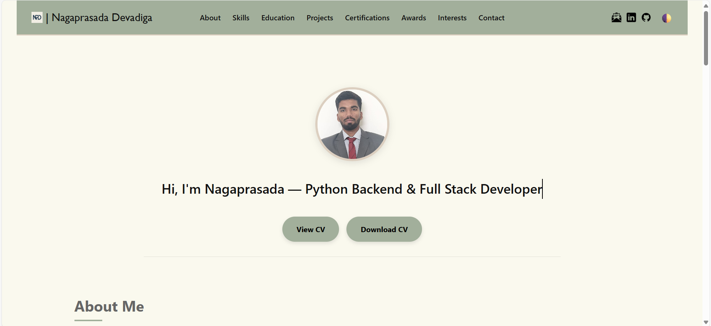
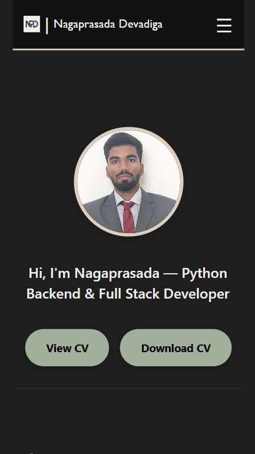
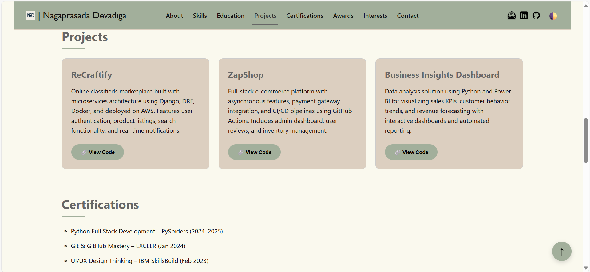
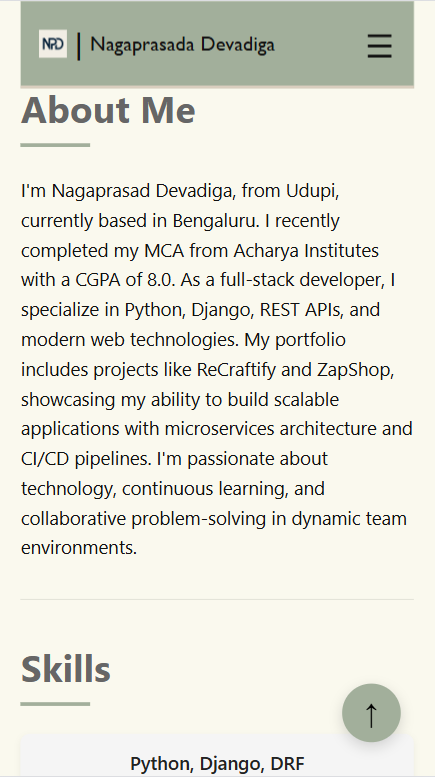

# 🌐 Nagaprasada Devadiga | Personal Portfolio

## 📌 About Me

Hi, I'm **Nagaprasada Devadiga**, a passionate Full Stack Developer specializing in **Python/Django**.  
I'm deeply interested in **Backend Development**, exploring **AI/ML**, and automating real-world solutions.  
I recently completed my **MCA** and have built multiple academic and personal projects with real-world features.

Welcome to my personal developer portfolio! 🚀

This site showcases my:
- 🔧 Skills in Python, Django, JavaScript, Docker, AWS, and more
- 💼 Projects including ReCraftify, ZapShop, and Business Insights Dashboard
- 📚 Education, Certifications, and Achievements
- 📬 Contact form powered by Formspree

---

🔗 **Live Site**: [https://Nagaprasad-77.github.io/portfolio](https://Nagaprasad-77.github.io/portfolio)

---

## 🔍 Features

- Responsive modern UI with dark/light mode
- Animated typewriter introduction
- Project cards with live preview links
- Mobile-friendly navigation
- Form handling with Formspree
- SEO optimized with meta tags

---

## 🛠️ Tech Stack

- HTML5, CSS3, JavaScript
- GitHub Pages for hosting
- GitHub Actions for CI/CD
- Formspree for contact forms
- Icons8 for vector icons

---

## 📸 Screenshots

| Desktop View | Mobile View |
|--------------|-------------|
|  |  |
|  |  |

---

## 📬 Contact Me

You can reach out through the contact form on the website, or directly:

- 📧 Email: [nagaprasaddevadiga77@gmail.com](mailto:nagaprasaddevadiga77@gmail.com)
- 🔗 LinkedIn: [Nagaprasad Devadiga](https://linkedin.com/in/nagaprasad-devadiga77)
- 🐙 GitHub: [Nagaprasad-77](https://github.com/Nagaprasad-77)

---

📜 License  
This project is open-source and free to use under the MIT License.

🙏 Special Thanks  
Thanks to Icons8 for providing free icons used in this portfolio.

Built with 💻 and ☕ by Nagaprasada Devadiga  